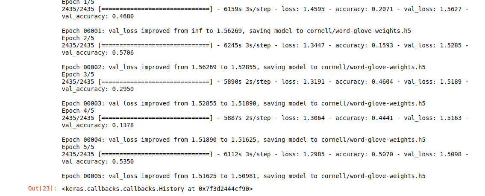
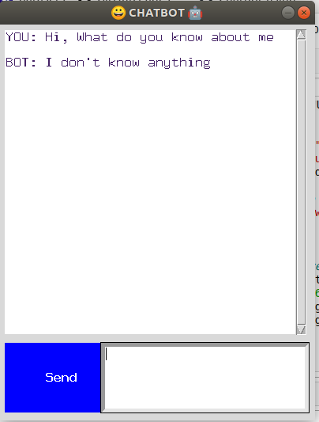

# &#x1F49C; Chatbot

## &#x1F539; AIM of the CHATBOT
    Aim of the project is to build an intelligent
    conversational chatbot, Riki, that can understand
    complex queries from the user and intelligently respond.
    
> “In the next few decades, as we continue to create our digital footprints, millennial's will have generated enough data to make “Digital Immortality” feasible” - *MIT Technology Review, October 2018.*

What if there is ‘life after death’ or you can talk to your loved ones, even after they left you? In the movie Transcendence
(2014), AI researcher, Evelyn uploaded her hubby’s consciousness into a quantum computer, just before his imminent death. While 
the post-death digital interactions with her hubby, remains a science fiction, as of today, it is feasible to create a digital 
imprint of you, who can talk just like you!

Digital “you” may look like a text-based chatbot or an audio voice like Siri or a digitally edited video or a 3-D animated 
character or even an embedded humanoid robot. But the main challenge is to personify the multiple personalities, that each one 
of us are! Yeah, we are different when we talk to different people, right? This is why the “Augmented Eternity” platform takes 
data from multiple sources — Facebook, Twitter, Messaging apps etc.

## &#x1F539; Recurrent Neural Networks & LSTMs

Humans don’t start their thinking from scratch every second. As you read this essay, you understand each word based on context, 
i.e. surrounding words and sentences. Your thoughts have persistence, which defines your learning.

As traditional neural networks cannot do this, Recurrent Neural Networks (RNN) are used. They are networks with loops, to allow information to persist. RNNs can be thought of as multiple copies of the same network, each passing a message to a successor

# 

The chain-like structure of RNNs are related to sequences, be it sequence of words, audio or images. For this reason, they are used with incredible success for language modeling, translation, speech recognition etc.

But RNNs struggle to connect information, when the gap grows, between relevant information and the place that it’s needed. Long Short Term Memory networks (“LSTMs”) are a special kind of RNN, capable of learning long-term dependencies.

# 

In sequence-to-sequence models (many-to-many RNN), when the size of input and output sequence is different, an encoder-decoder architecture is used. Decoder starts only after encoder finishes. Eg: Machine Translation, Text Summarization, Conversational Modeling, Image Captioning, and more.

# 

Encoder units helps to ‘understand’ the input sequence (“Are you free tomorrow?”) and the decoder decodes the ‘thought vector’ and generate the output sequence (Yes, what’s up?”). Thought vector can be thought of as neural representational form of input sequence, which only the decoder can look inside and produce output sequence.

## &#x1F539; DataSet

This corpus contains a large metadata-rich collection of fictional conversations extracted from
raw movie scripts:

➢ 220,579 conversational exchanges between 10,292 pairs of movie characters

➢ involves 9,035 characters from 617 movies

➢ in total 304,713 utterances

➢ movie metadata included:

      o genres
      o release year
      o IMDB rating
      o number of IMDB votes
      o IMDB rating
      ➢ character metadata included:
      o - gender (for 3,774 characters)
      o - position on movie credits (3,321 characters)
      

## &#x1F539; Data Preprocessing

    1 - Cleaning the raw corpus of movie conversation data and then they are converted to id.
    2 - To encode our raw data we used Glove word embedding.The advantage of GloVe is that, unlike Word2vec,
        GloVe does not rely just on local statistics (local context information of words), but incorporates global
        statistics (word co-occurrence) to obtain word vectors.
    3 - Then trainning data is generated using generators and then fit to the model
    

## &#x1F539; Model Architecture

> <h3>➢ The architecture of the model has been defined below</h3>

# 

> <h3>➢ Below is the model summary</h3>

# 

> <h3>➢ Run the model and improve the accuracy</h3>

# 

> <h3>➢ A design of how the tkinter chatbot looks is below</h3>

# 

# 
 
 
 
# 

